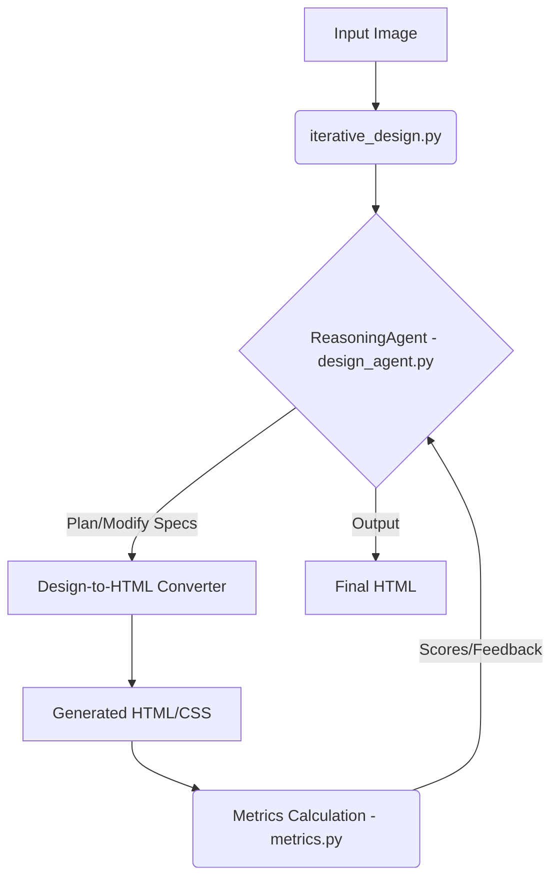

<p align="center">
  
</p>

<h1 align="center">DesignLoop AI</h1>

<p align="center">
  <strong>Self-improving agent refining HTML design via visual feedback.</strong>
</p>

<p align="center">
  <a href="https://github.com/Lumi-node/design-loop-ai"></a>
  <a href="https://github.com/Lumi-node/design-loop-ai"></a>
  <a href="https://github.com/Lumi-node/design-loop-ai"></a>
</p>

---

DesignLoop AI is a sophisticated proof-of-concept demonstrating an autonomous agent capable of iteratively refining raw HTML designs based on visual quality metrics. It bridges the gap between high-level design intent (visual mockups) and production-ready code by employing a closed-loop feedback system.

This project matters because it explores the frontier of AI-driven design automation, aiming to move beyond simple code generation toward true, self-correcting design optimization across multiple measurable dimensions like accessibility and visual harmony.

---

## Quick Start

```bash
pip install design_loop_ai
```

```python
from iterative_design import run_design_loop
from PIL import Image

# Assuming 'input_mockup.png' is the initial design image
initial_image = Image.open("input_mockup.png")

# Run the agent to refine the design against target quality thresholds
final_html_output = run_design_loop(
    initial_image, 
    target_accessibility=0.9, 
    max_iterations=5
)

print("Design refinement complete. Final HTML generated.")
# final_html_output contains the optimized HTML string
```

## What Can You Do?

### Iterative Refinement
The core functionality is the agent's ability to cycle through planning, execution, and evaluation. The `design_agent.py` wraps the design-to-HTML converter within a ReasoningAgent loop.

```python
from design_agent import ReasoningAgent

agent = ReasoningAgent()
# The agent analyzes the current state and decides on the next action
next_action = agent.think(current_html_state) 
```

### Metric Observation
The `metrics.py` module is responsible for extracting quantitative data from the generated HTML/CSS, allowing the agent to objectively measure improvement.

```python
from metrics import calculate_contrast_ratio

# Calculate the contrast ratio between two defined colors
ratio = calculate_contrast_ratio("#FFFFFF", "#000000")
print(f"Contrast Ratio: {ratio:.2f}")
```

## Architecture

DesignLoop AI operates as a closed-loop system orchestrated by `iterative_design.py`.

1.  **Input:** An initial design image is fed into `iterative_design.py`.
2.  **Agent Loop:** The `ReasoningAgent` (`design_agent.py`) takes control.
3.  **Think/Act:** The agent uses design principles to formulate a plan (`think()`) and modifies the design specifications to regenerate components (`act()`).
4.  **Observe:** The resulting HTML is processed by `metrics.py` to extract objective scores (e.g., accessibility, symmetry).
5.  **Feedback:** These metrics are fed back to the agent, allowing it to adjust its strategy for the next iteration until quality thresholds are met or the iteration limit is reached.



## API Reference

### `design_agent.ReasoningAgent`
The central control unit.
*   `think(state: str) -> Action`: Analyzes the current design state and determines the next required action (e.g., "Increase padding on header").
*   `act(action: Action, specs: Dict) -> Dict`: Executes the action by modifying the underlying design specifications.
*   `observe(html: str) -> Dict`: (Internal/Helper) Extracts measurable data from the rendered output.

### `iterative_design.run_design_loop(image: Image, **kwargs) -> str`
The primary entry point.
*   **Signature:** `run_design_loop(image: Image, target_accessibility: float, max_iterations: int) -> str`
*   **Description:** Manages the entire lifecycle, starting from the initial image to the final optimized HTML string.

## Research Background

This project is inspired by research in Reinforcement Learning applied to creative tasks, specifically leveraging the concept of self-correction in generative models. The methodology draws parallels from visual quality assessment frameworks used in HCI research, adapted for automated code refinement.

## Testing

The project includes 9 unit and integration tests located in the `tests/` directory, ensuring the core logic of metric calculation and agent state transitions remains robust.

## Contributing

We welcome contributions! Please feel free to fork the repository and submit a Pull Request. Check out our `CONTRIBUTING.md` (if available) for guidelines on coding standards and submission processes.

## Citation

This work builds upon foundational concepts in automated UI generation and AI-driven design optimization. Further reading on related topics can be found in papers concerning visual grounding and iterative refinement algorithms.

## License
The project is licensed under the MIT License - see the [LICENSE](LICENSE) file for details.