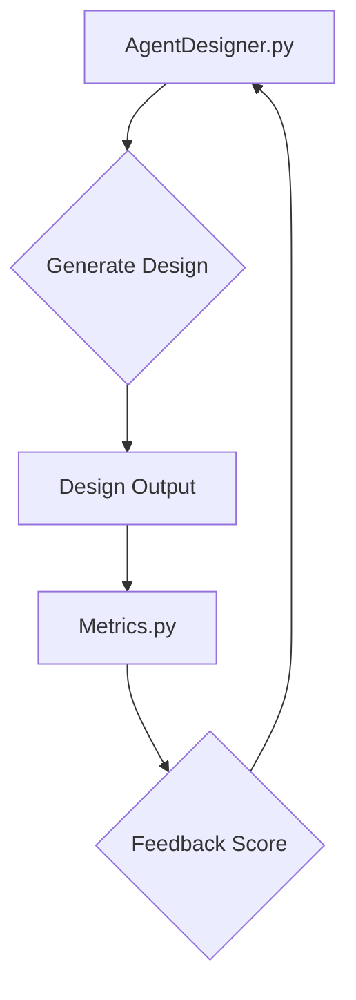

<p align="center">
  
</p>

<h1 align="center">DesignLoop AI</h1>

<p align="center">
  <strong>Self-improving agent using visual feedback for automated design iteration.</strong>
</p>

<p align="center">
  <a href="https://github.com/Lumi-node/design-loop-ai"></a>
  <a href="https://www.python.org/downloads/"></a>
  <a href="https://github.com/Lumi-node/design-loop-ai"></a>
</p>

---

DesignLoop AI is a sophisticated research artifact demonstrating the capabilities of autonomous agents in the domain of automated design. It functions as a self-improving system capable of iterating on design outputs based on visual feedback, moving beyond static generation to active refinement.

This project serves as a proof-of-concept for complex, closed-loop AI systems where the agent observes its output, evaluates it against metrics, and modifies its internal state or generation parameters to achieve a desired design goal autonomously.

---

## Quick Start

```bash
pip install design_loop_ai
```

```python
from design_loop_ai.agent_designer import AgentDesigner
from design_loop_ai.metrics import evaluate_design

# Initialize the agent
designer = AgentDesigner()

# Simulate a design generation and evaluation loop
initial_design = designer.generate_initial_design()
feedback = evaluate_design(initial_design)

# The agent uses feedback to refine the design
refined_design = designer.refine_design(initial_design, feedback)
print("Design iteration complete.")
```

## What Can You Do?

### Autonomous Design Iteration
The core functionality allows the agent to take an initial design concept and iteratively improve it. It uses a feedback loop derived from defined metrics to guide its modifications.

```python
# Example of using the refinement method
current_state = {"layout": "grid", "color_scheme": "blue"}
new_state = designer.refine_design(current_state, {"score": 0.75, "issues": ["alignment_error"]})
print(f"New design state: {new_state}")
```

### Metric-Driven Evaluation
The `metrics.py` module provides tools to quantitatively assess the quality of the generated design against predefined criteria, which feeds directly back into the agent's learning process.

```python
from design_loop_ai.metrics import evaluate_design

# Assume 'design_output' is a structure representing the current design
design_output = {"elements": ["header", "body"], "complexity": 0.8}
results = evaluate_design(design_output)
print(f"Evaluation results: {results}")
```

## Architecture

The system is structured around a core control loop managed by `agent_designer.py`. This module orchestrates the process: it calls generation functions (potentially leveraging `html_generator`), feeds the output into `metrics.py` for scoring, and then uses the resulting feedback to inform the next iteration of the agent.

The flow is: **Agent $\rightarrow$ Generate $\rightarrow$ Evaluate (Metrics) $\rightarrow$ Refine $\rightarrow$ Agent**.



## API Reference

### `agent_designer.AgentDesigner`
The main class managing the design loop.

*   `__init__()`: Initializes the agent's internal state and configuration.
*   `generate_initial_design()`: Creates the first version of the design.
*   `refine_design(current_design, feedback)`: Applies learned adjustments based on evaluation feedback.

### `metrics.evaluate_design(design_data)`
Calculates a quantitative score for a given design structure.

*   **Signature**: `evaluate_design(design_data: dict) -> dict`
*   **Returns**: A dictionary containing scores and identified issues.

## Research Background

This work is inspired by reinforcement learning paradigms applied to creative tasks, specifically exploring how visual feedback can serve as a reward signal for autonomous systems. Further reading on self-improving agents and visual grounding is recommended.

## Testing

The project includes 9 unit tests located in the `tests/` directory, ensuring the core logic within `agent_designer.py` and `metrics.py` functions as expected.

## Contributing

Contributions are welcome! Please read the contribution guidelines (if available) and submit pull requests.

## Citation

This project is an R&D artifact. Specific citations related to the underlying AI techniques should be added if the implementation relies heavily on published academic work.

## License
MIT

---
**Repository:** https://github.com/Lumi-node/design-loop-ai
**Documentation:** https://lumi-node.github.io/design-loop-ai/
**Author:** Andrew Young, Automate Capture Research