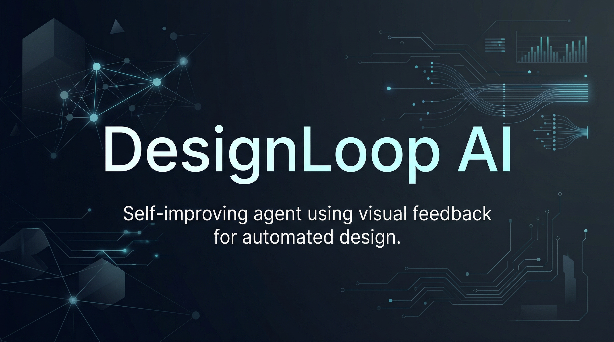

<p align="center">
  
</p>

<h1 align="center">DesignLoop AI</h1>

<p align="center">
  <strong>Deterministic HTML quality metrics and autonomous design iteration agent.</strong>
</p>

<p align="center">
  <a href="https://github.com/Lumi-node/design-loop-ai"></a>
  <a href="https://www.python.org/downloads/"></a>
  <a href="https://github.com/Lumi-node/design-loop-ai"></a>
</p>

---

DesignLoop AI provides two things:

1. **A standalone HTML quality metrics library** (fully functional, 44 tests passing) that measures DOM structure, WCAG contrast ratios, layout symmetry, accessibility compliance, and responsive breakpoints.
2. **A design iteration agent** that uses those metrics in a think-act-observe loop to autonomously improve HTML/CSS quality. The agent module depends on external source modules (an HTML generator and image processing pipeline) that are not bundled in this repository.

The metrics module is the primary value -- it implements real WCAG 2.1 math, gamma-corrected luminance calculations, and variance-based layout analysis. All functions are deterministic: same input HTML produces the same scores every run.

---

## Installation

```bash
pip install design-loop-ai
```

Or install from source:

```bash
git clone https://github.com/Lumi-node/design-loop-ai.git
cd design-loop-ai
pip install -e ".[dev]"
```

## Metrics Module

The `metrics` module provides five deterministic measurement functions for HTML quality analysis. No external services or APIs required.

### DOM Depth Analysis

```python
from metrics import extract_dom_depth

html = '<html><body><div><div><p>Hello</p></div></div></body></html>'
depth = extract_dom_depth(html)  # Returns 6
```

### WCAG Contrast Ratios

Calculates contrast ratios between text and background colors following the WCAG 2.1 formula with proper sRGB gamma correction.

```python
from metrics import extract_contrast_ratios

html = '<div style="background-color: #FFFFFF; color: #000000;">High contrast</div>'
ratios = extract_contrast_ratios(html)
# Returns: {'element_0_text_bg': 21.0}
# Values range from 1.0 (no contrast) to 21.0 (maximum: black on white)
```

Supports both inline styles and CSS class definitions, hex (`#RRGGBB`) and `rgb()` color formats.

### Layout Symmetry

Measures how evenly distributed flex or height-based layouts are, using variance of normalized proportions.

```python
from metrics import calculate_layout_symmetry

# Three equal flex regions = perfect symmetry
html = '''
<div class="container">
  <div style="flex: 1">A</div>
  <div style="flex: 1">B</div>
  <div style="flex: 1">C</div>
</div>
'''
score = calculate_layout_symmetry(html)  # Returns 1.0 (perfectly symmetric)
```

Returns a float from 0.0 (fully asymmetric) to 1.0 (perfectly symmetric).

### Accessibility Scoring

Weighted WCAG 2.1 AA compliance score across structural elements, semantic HTML, contrast, alt text, form labels, and heading hierarchy.

```python
from metrics import calculate_accessibility_score

score = calculate_accessibility_score(html)  # Returns float 0-100
```

Scoring breakdown:
- Required elements (`html`, `head`, `body`, `title`): +10 each
- Semantic elements (`h1`, `nav`, `main`, `footer`): +5 each
- Contrast pairs meeting AA threshold (4.5:1): +2 each, -1 for non-compliant
- Image alt text: +5 each (max +20)
- Form labels: +5 each (max +20)
- Correct heading hierarchy: +10

### Responsive Breakpoints

Extracts media query breakpoints from embedded CSS.

```python
from metrics import extract_responsive_breakpoints

breakpoints = extract_responsive_breakpoints(html)  # Returns sorted list, e.g. [480, 768, 1024]
```

## Agent Module

The `agent_designer` module implements `DesignAgent` and `DesignIterationEnvironment` for autonomous design improvement through a think-act-observe cycle.

**Important:** The agent's `act()` method depends on an `html_generator` module from an external source directory that is not included in this repository. The `observe()` and `think()` methods work standalone using the metrics module, but full end-to-end iteration requires providing the HTML generation pipeline separately.

### What the agent does (conceptually)

```
Observe (metrics.py)  -->  Think (heuristics)  -->  Act (generate HTML)
       ^                                                    |
       |_____________ iterate until converged ______________|
```

The agent implements three heuristics:
1. **Contrast Gap Closure**: shifts colors toward extremes when avg contrast < 4.5
2. **Layout Symmetry Balance**: adjusts region percentages toward the mean when symmetry < 0.9
3. **Accessibility Score Gap**: applies color/layout refinements when score < 70

### Using the environment and agent independently

```python
from agent_designer import DesignIterationEnvironment

# Manage design specs and track iteration history
env = DesignIterationEnvironment()
print(env.spec)  # Default spec with intentionally poor contrast/layout

# Validate and apply modifications
env.apply_spec_modifications({
    'colors': {'header': ['#000000']},
    'layout_regions': {'header_height_percent': 15}
})

# Record metrics per iteration
env.record_iteration({
    'accessibility_score': 65.0,
    'layout_symmetry': 0.8,
    'dom_depth': 4,
    'contrast_ratios': {'header_text_bg': 12.5},
    'avg_contrast_ratio': 12.5
})
```

## Architecture

```
metrics.py                  Standalone HTML quality metrics (fully functional)
  extract_dom_depth()         DOM nesting depth
  extract_contrast_ratios()   WCAG contrast ratio calculation
  calculate_layout_symmetry() Variance-based layout balance
  calculate_accessibility_score()  Weighted WCAG 2.1 AA scoring
  extract_responsive_breakpoints() Media query extraction

agent_designer.py           Design iteration agent (requires external html_generator)
  DesignAgent                 Think-act-observe agent with contrast/layout heuristics
  DesignIterationEnvironment  Spec management, validation, iteration tracking

design_agent.py             Alternative agent (requires external sources/ directory)
  DesignAgent                 Extends ReasoningAgent for image-based design refinement

iterative_design.py         End-to-end orchestrator (requires external sources/)
main.py                     Iteration loop runner (requires external sources/)
```

## Testing

The metrics module has comprehensive test coverage (44 tests):

```bash
pytest tests/test_metrics.py -v
```

Tests cover DOM depth extraction, WCAG contrast math, layout symmetry calculation, accessibility scoring, responsive breakpoints, edge cases, malformed HTML handling, and determinism guarantees.

## Research Background

This project explores closed-loop autonomous design systems where an agent observes its output, evaluates it against quantitative metrics, and modifies its generation parameters to converge on quality targets. The metrics module implements established WCAG 2.1 accessibility standards; the agent applies gradient-free heuristic optimization over the design parameter space.

## Contributing

Contributions are welcome. Please read [CONTRIBUTING.md](CONTRIBUTING.md) for guidelines.

## License

MIT

---
**Repository:** https://github.com/Lumi-node/design-loop-ai
**Author:** Andrew Young, Automate Capture Research
