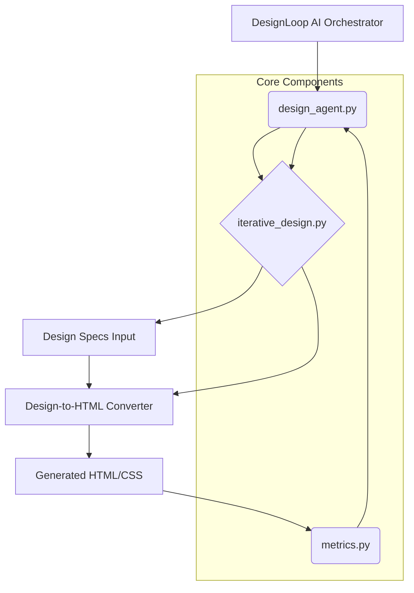

# Architecture: DesignLoop AI

DesignLoop AI is an autonomous, iterative design optimization system designed to evolve a baseline design mockup into a high-quality, production-ready interface. It operates as a closed-loop feedback system, where an AI agent continuously analyzes the generated output against predefined design principles, diagnoses weaknesses, and autonomously refines the underlying design specifications until measurable quality thresholds are met.

## System Overview

The core of DesignLoop AI is the `design_agent.py`, which orchestrates the entire refinement process. This agent leverages the other modules to perform a cycle of **Think $\rightarrow$ Act $\rightarrow$ Observe**. It takes an initial design prompt, generates an HTML/CSS output, evaluates that output using quantitative metrics, and then modifies the input design specifications to guide the next, improved generation. The system's success is defined by its ability to demonstrably improve a baseline design across at least three measurable dimensions (e.g., accessibility, layout symmetry, color harmony) within a maximum of five iterations.

## Module Relationships

The following diagram illustrates how the components interact within the DesignLoop AI framework:

## Module Descriptions

*   **`design_agent.py` (The Brain):** This module encapsulates the core reasoning loop. It implements the `think()`, `act()`, and `observe()` methods.
    *   **`think()`:** Analyzes the current HTML output against established design heuristics (e.g., WCAG contrast ratios, grid alignment, semantic correctness). It identifies specific areas of failure or sub-optimality.
    *   **`act()`:** Based on the analysis from `think()`, it generates targeted modifications to the design specifications (e.g., "Increase padding on component X by 10px," or "Change primary color to hex code Y").
    *   **`observe()`:** Interfaces with `metrics.py` to quantify the current state of the design.
*   **`iterative_design.py` (The Conductor):** This module manages the state and flow of the design process. It controls the iteration count, passes the current design specifications to the converter, and manages the loop termination condition (success or failure).
*   **`metrics.py` (The Judge):** This module is responsible for quantitative evaluation. It parses the generated HTML/CSS and calculates objective scores for defined dimensions, such as:
    *   Accessibility Score (e.g., contrast ratio compliance).
    *   Layout Symmetry Score (e.g., deviation from a perfect grid).
    *   Color Harmony Score (e.g., adherence to established color theory palettes).
*   **`tests/__init__.py` (The Validator):** Contains unit and integration tests to ensure the reliability and correctness of the agent's logic, metric calculations, and the stability of the design conversion process.

## Data Flow Explanation

The process follows a strict, cyclical data flow:

1.  **Initialization:** `iterative_design.py` starts with an initial set of **Design Specifications** and passes them to the Design-to-HTML Converter.
2.  **Generation:** The Converter produces the **Generated HTML/CSS**.
3.  **Observation:** The `design_agent.py` calls `metrics.py`, passing the HTML/CSS. `metrics.py` returns a set of **Quantitative Metrics** (e.g., `{accessibility: 0.85, symmetry: 0.72}`).
4.  **Reasoning (Think):** The agent analyzes these metrics against the target goals. If the goals are not met, the `think()` function determines *why* the design failed (e.g., "Low contrast in header").
5.  **Action (Act):** The agent translates this diagnosis into concrete changes, generating **Modified Design Specifications**.
6.  **Iteration:** `iterative_design.py` receives the Modified Specifications and loops back to Step 2, continuing until the success criteria (3+ dimensions improved within 5 iterations) are satisfied or the iteration limit is reached.