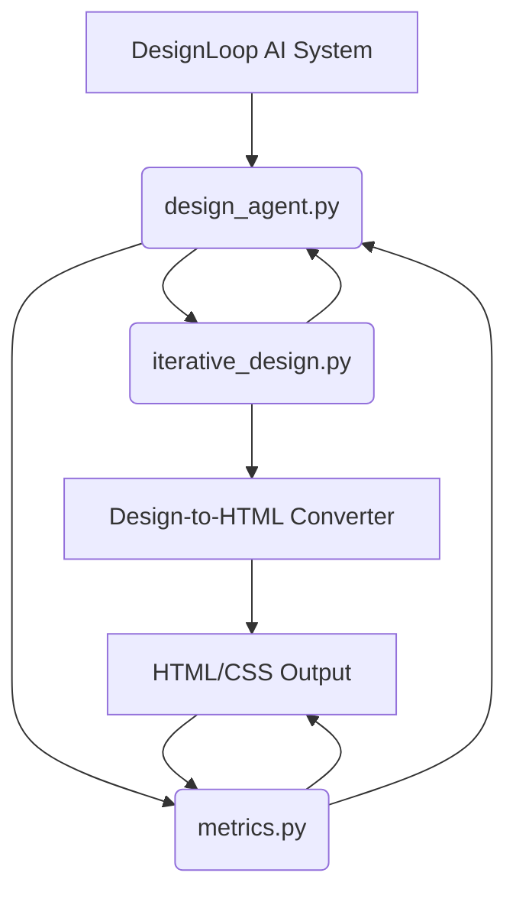

# Architecture: DesignLoop AI

DesignLoop AI is an intelligent, iterative design refinement system designed to automatically evolve a baseline design mockup into a high-quality, production-ready artifact. Instead of relying on manual designer feedback, DesignLoop AI employs a closed-loop feedback mechanism where an AI agent continuously analyzes, critiques, and regenerates design components based on quantifiable design principles. The system operates by cycling through reasoning, action, and observation until predefined quality thresholds are met.

## System Diagram

The following diagram illustrates the relationships and dependencies between the core modules of the DesignLoop AI framework.

## Module Descriptions

### `design_agent.py` (The Brain)
This is the core control module, implementing the Reasoning Agent loop. The `DesignAgent` orchestrates the entire refinement process.
*   **`think()`:** Analyzes the current state (HTML/CSS) against a set of established design principles (e.g., WCAG contrast ratios, grid alignment, semantic correctness). It generates a critique and determines the necessary modifications.
*   **`act()`:** Translates the critique into actionable changes. It modifies the design specifications (e.g., changing a color hex code, adjusting padding values) and passes these updated specs to the regeneration pipeline.
*   **`observe()`:** Interfaces with the output to extract measurable data, feeding the results back into the agent's reasoning process.

### `iterative_design.py` (The Engine)
This module manages the state and flow of the design loop. It handles the orchestration of the regeneration process. It takes the modified design specifications from the `design_agent` and drives the external **Design-to-HTML Converter** to produce a new version of the design artifact. It ensures the loop continues until the success criteria are met or a maximum iteration limit is reached.

### `metrics.py` (The Judge)
This module is responsible for quantitative evaluation. It parses the generated HTML and associated CSS to calculate objective design scores. Key metrics include:
*   **Accessibility Score:** Based on contrast ratios and ARIA usage.
*   **Layout Symmetry:** Measuring deviation from ideal grid alignment.
*   **Color Harmony:** Analyzing color palettes against established theory.

### `tests/__init__.py` (The Validator)
This directory contains unit and integration tests to ensure the robustness and correctness of the agent's logic, the metric calculations, and the state transitions within the iterative loop.

## Data Flow Explanation

The DesignLoop AI process follows a strict Observe $\rightarrow$ Think $\rightarrow$ Act $\rightarrow$ Observe cycle:

1.  **Initialization:** The process begins with a baseline design mockup and initial specifications.
2.  **Observation (Initial):** `metrics.py` analyzes the initial HTML output to establish baseline scores across the target dimensions (Accessibility, Symmetry, Harmony).
3.  **Thinking:** `design_agent.py` receives these metrics. Its `think()` method compares the current scores against the target goals. If the goals are not met, it generates a detailed critique identifying specific areas for improvement (e.g., "Contrast ratio in CTA button is 2.5:1, needs to be $\ge 4.5:1$").
4.  **Acting:** The agent's `act()` method translates this critique into concrete changes, modifying the design specifications (e.g., changing the button's background color).
5.  **Iteration/Regeneration:** `iterative_design.py` takes these new specifications and feeds them into the **Design-to-HTML Converter**, generating a new HTML/CSS artifact.
6.  **Observation (Next Cycle):** The new artifact is passed back to `metrics.py` for re-evaluation.
7.  **Convergence:** This loop repeats. The process terminates successfully when the `design_agent` determines that all three measurable dimensions have improved sufficiently across the required iterations (Success Criterion: $\ge 3$ dimensions improved within $\le 5$ iterations).