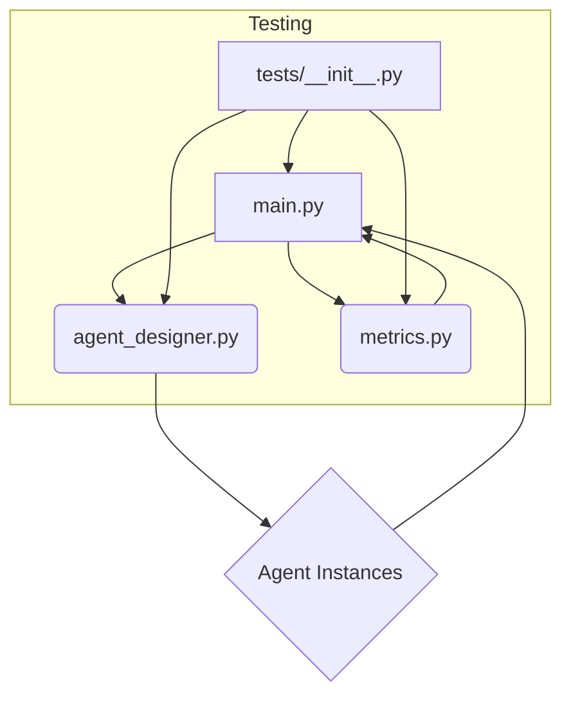

# Architecture: DesignLoop AI

DesignLoop AI is a sophisticated, modular system designed to automate and optimize the design process through intelligent agent orchestration. The architecture is built around a core loop where specialized AI agents are designed, executed, and evaluated against predefined metrics. This structure allows for iterative refinement, enabling the system to learn and improve its design outputs autonomously.

## Module Relationships

The following diagram illustrates the dependencies and interactions between the core components of DesignLoop AI.

## Module Descriptions

### `main.py`
This serves as the primary entry point and orchestrator of the entire DesignLoop AI system. It manages the overall workflow: initializing the design process, invoking the `agent_designer` to create or modify agents, running the agents, and finally utilizing `metrics.py` to evaluate the results. It acts as the central control plane.

### `agent_designer.py`
This module is responsible for the creation, configuration, and management of the AI agents. It encapsulates the logic for defining agent roles, setting up their operational parameters, and potentially implementing meta-level design decisions (e.g., deciding which agent is best suited for a specific sub-task). It generates the executable agent instances.

### `metrics.py`
This module is dedicated to evaluation. It houses the logic for defining, calculating, and reporting on the performance of the generated designs or the outputs of the agents. It provides quantitative feedback to the system, which is crucial for the iterative improvement loop managed by `main.py`.

### `tests/__init__.py`
This directory contains the unit and integration tests for all other modules. It ensures the robustness and correctness of the agent design logic, the metric calculations, and the overall system flow before deployment or execution.

## Data Flow Explanation

The data flow in DesignLoop AI follows a clear, iterative cycle:

1. **Initialization (`main.py`):** The process begins in `main.py`, which receives the initial design goal or problem statement.
2. **Agent Generation (`main.py` $\rightarrow$ `agent_designer.py`):** `main.py` passes the goal to `agent_designer.py`. The designer module processes this input to construct and configure one or more specialized AI agents.
3. **Execution (Internal to Agents):** The configured agents are executed (this execution step is abstracted but driven by the configuration from `agent_designer.py`).
4. **Evaluation (`main.py` $\rightarrow$ `metrics.py`):** Once the agents produce an output or a set of results, `main.py` passes these results to `metrics.py`. The metrics module calculates scores, identifies weaknesses, and generates a performance report.
5. **Feedback Loop (`metrics.py` $\rightarrow$ `main.py` $\rightarrow$ `agent_designer.py`):** The performance report from `metrics.py` is returned to `main.py`. `main.py` uses this feedback to inform the next iteration, potentially instructing `agent_designer.py` to modify the agents' parameters, change their roles, or initiate a completely new design cycle, thus closing the loop.